# Longitudinal Snapshot Dataset Architecture & Retraining Roadmap (SIH 2026)

## 1. Executive Summary

In land acquisition administration, a static project-level outcome label answers only:
> *"Did this completed project experience a delay in the past?"*

For the **Smart India Hackathon 2026 Early-Warning Mandate**, the model must answer:
> *"Given the project's current operational state today at lifecycle stage $S$, what is the probability that it will experience a milestone delay within the next 30/60/90 days?"*

This document outlines the evolutionary transition from our current MVP dataset (`land_data.csv`) to a **longitudinal snapshot-based schema**.

---

## 2. Target Longitudinal Snapshot Schema

Each active project generates periodic state snapshots (e.g. monthly or on milestone transitions):

```csv
project_id,snapshot_date,current_stage,total_acres,land_acquired_pct,approval_days_pending,compensation_disbursed_pct,legal_cases_count,ownership_disputes,rnp_progress_pct,possession_pct,affected_families,doc_deficiency_score,historical_district_delay_avg,future_delay_label_30d,future_delay_label_90d,future_delay_days
```

### Schema Definitions

| Field Name | Type | Category | Description | Available at Inference? |
| :--- | :--- | :--- | :--- | :--- |
| `project_id` | Integer | Identifier | Project unique reference | Excluded (Leakage) |
| `snapshot_date` | Date | Metadata | Timestamp when project observation was recorded | Excluded (Leakage) |
| `current_stage` | Enum | Feature | Notification, Documentation, Approval, Compensation, R&R, Possession | **YES** |
| `total_acres` | Float | Feature | Total parcel acreage under acquisition | **YES** |
| `land_acquired_pct` | Float | Feature | Percentage of section 19/award land notified | **YES** |
| `approval_days_pending` | Integer | Feature | Days pending sanction by competent authority | **YES** |
| `compensation_disbursed_pct` | Float | Feature | Disbursed award compensation percentage via DBT | **YES** |
| `legal_cases_count` | Integer | Feature | Active writ petitions / high court stay petitions | **YES** |
| `ownership_disputes` | Integer | Feature | Revenue title defect disputes flagged | **YES** |
| `rnp_progress_pct` | Float | Feature | Rehabilitation & Resettlement civic site progress % | **YES** |
| `possession_pct` | Float | Feature | Physical encumbrance-free site possession % | **YES** |
| `affected_families` | Integer | Feature | Number of project-affected families | **YES** |
| `doc_deficiency_score` | Float | Feature | Defect score from land record verification | **YES** |
| `historical_district_delay_avg`| Float | Feature | Benchmark delay days for district | **YES** |
| `future_delay_label_30d` | Binary (0/1) | Target | Did project delay materialize within 30 days of snapshot? | Excluded (Target) |
| `future_delay_label_90d` | Binary (0/1) | Target | Did project delay materialize within 90 days of snapshot? | Excluded (Target) |
| `future_delay_days` | Integer | Outcome | Exact days delayed past scheduled milestone | Excluded (Outcome) |

---

## 3. Temporal Train / Validation / Test Splitting

Pure random cross-validation can inadvertently allow temporal leakage (predicting past events from future data). With longitudinal snapshots, splitting is performed on a time horizon:

```text
Time Scale ─────────────────────────────────────────────────────────────►
[   Historical Snapshots: 2023 - 2025   ]  │  [  Evaluation Snapshots: 2026  ]
                  ↓                                       ↓
         Training Dataset (80%)                  Holdout Test Dataset (20%)
```

- **Training Window**: All project snapshots prior to cutoff date $T_{\text{cutoff}}$.
- **Test Window**: All project snapshots after $T_{\text{cutoff}}$.
- **Simulation**: Accurately mimics how the model deployed in 2026 predicts unseen upcoming quarters.

---

## 4. Controlled Retraining Workflow (Continuous Learning Loop)

```mermaid
graph LR
    P[Prediction Given Current State] --> I[Administrative Intervention Logged]
    I --> O[Confirmed Milestone Outcome Recorded]
    O --> Q[Outcome Feedback Queue: feedback_log.csv]
    Q -->|Threshold >= 50 New Outcomes| R[Automated Retraining Pipeline]
    R --> E[Model Evaluation & Drift Check]
    E -->|If Recall & ROC-AUC Maintained| D[Deploy Updated Model delay_model.pkl]
```



1. **Prediction**: Officer enters current parameters via `POST /predict`.
2. **Intervention**: Officer logs remediation (e.g. DBT release batch) via `PUT /projects/status`.
3. **Ground Truth**: Upon milestone completion, actual outcome is logged via `POST /feedback/outcome`.
4. **Controlled Retrain**: `continuous_learning.py` triggers when 50 new validated project outcomes accumulate, updating `delay_model.pkl` and `model_metrics_history.json`.
